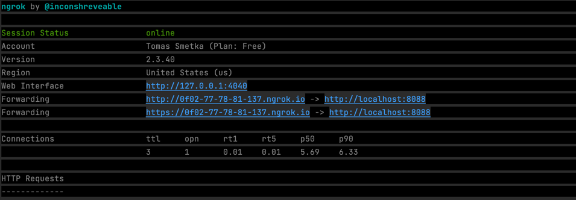
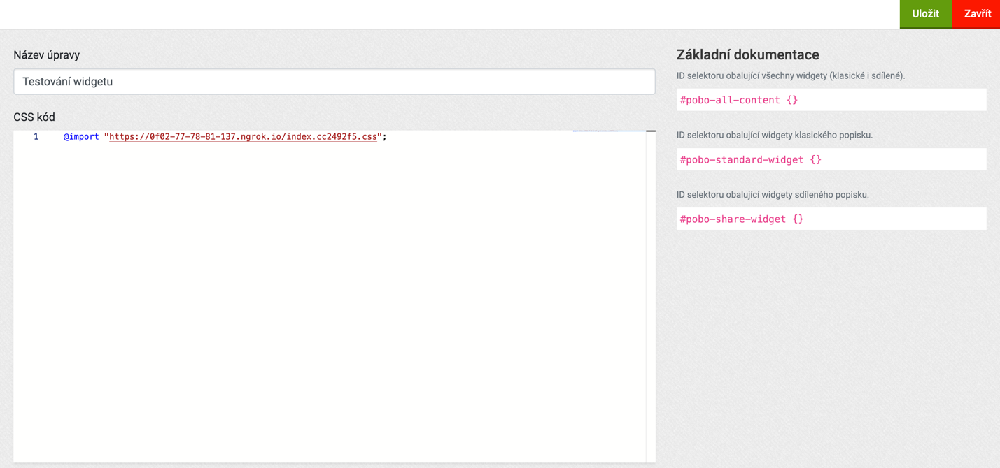

# Generic Templates (POC)

This repository contains generic templates for widgets in Pobo Page Builder.

Changelog versions:

- [3.4.2](version/3.4.2.md) - Fix `.rc-profit` icon width
- [3.4.1](version/3.4.0.md) - Extension of variables
- [3.4.0](version/3.4.0.md) - Add multi-column widgets
- [3.3.0](version/3.3.0.md) - New gallery - PhotoSwipe
- [3.2.0](version/3.2.0.md) - Fix font family, add variable for image alignment
- [3.1.0](version/3.1.0) - Fix max width widget
- [3.0.2](version/3.0.2.md) - Fix `<li>` circle, remove native variable
- [3.0.1](version/3.0.1.md) - Fix bug with full-width widget, add font family variable
- [3.0.0](version/3.0.0.md) - Support full-width widget, add background, spacing widget support
- [2.0.3](version/2.0.3.md) - Add variables for list item, paragraph, title line, standard table
- [2.0.2](version/2.0.2.md) - Add background color variable
- [2.0.1](version/2.0.1.md) - Add mobile variable support
- [2.0.0](version/2.0.0.md) - First version

## Classes with a question mark

- [ ] `rc-header-top-image-bottom`
- [x] `*__image` - image alignment
- [x] `typo - h2, h3, h4` - font family
- [x] `typo - h2, h3, h4` - font family
- [x] `typo - p` - font weight


# Creating a Widget in Pobo Page Builder

This repository is primarily for Pobo Page Builder plugin clients who want to customize the appearance of their widgets.

## Before we start...

Before starting, you need to have the following tools installed on your computer:

1. Version control system [git](https://git-scm.com/)
2. [nodejs](https://nodejs.org/en/) (min. >=10.19)
3. [npm](https://www.npmjs.com/) (min. >=6) or [Yarn](https://yarnpkg.com/)

## Cloning the repository

1. Clone the repository using:

```
git clone git@github.com:pobo-builder/widget-asset.git
```

Then install the dependencies using:
```
npm install
```
If you are using Yarn:
```
yarn install
```

# Directory structure

After installing the dependencies, you will see the following structure:

``` 
├── README.md
├── dist
├── node_modules
├── package-lock.json
├── package.json
└── src
    └── *.scss
```

Main points of interest:

1. The `dist/*` directory contains JS and CSS compiled from the `src/*` directory.
2. The `src/*` directory contains the source SCSS files for individual Pobo widgets.
3. The `package.json` file includes the following scripts in the `scripts` section:
   1. `watch` (run with `npm run watch`) watches all files in the `src/*` directory and compiles them into `dist/*` upon changes.
   2. `build` (run with `npm run build`) compiles the `src/*` files into `dist/*`, removes source maps, and minifies the code.
   3. `proxy` (`npm run proxy`) creates a tunnel (proxy) from `localhost:8088` to a public URL (explained further below).


## Writing Your First Widget

Let's start by coding our first widget. First, create a new PR:
`git checkout -b "widget-fv-bikemax-benefix-big" origin/main`.

Next, create a new SCSS file in the `src/*` directory and name it using the convention `[brand]-[client]-[widget-type]-[variant]` (e.g., `fv-bikemax-benefit-big.scss`). Import this SCSS file into `src/editor.scss` (e.g., `@import "fv-bikemax-benefit-big.scss";`).

Run the command `npm run watch` to watch for changes in SCSS files, compile them into CSS, and create a server displaying styled widgets at `http://localhost:8088`.

## Writing CSS (SCSS)

We recommend styling widgets using the [BEM methodology](https://www.vzhurudolu.cz/prirucka/bem), which ensures low specificity and minimal risk of interference with external modifications (e.g., overriding styles by a template, global adjustments by coders, etc.).

When writing classes, **we recommend** using prefixes based on the SCSS file name (e.g., `.fv-bikemax-benefit-big`). This avoids conflicts with other widgets. The code should look something like this:

```scss
.fv-bikemax-benefit-big {
  &__title {
    font-size: 10px;
  }
  
  &__subtitle {
    font-size: 20px;
  }

  &__image {
    float: left;
  }
}
```

**Important Information:** Do not use prefixes like `.pb-*` or `.rc-*` as these are reserved for Pobo Page Builder widgets available to all clients, and conflicts may occur.

...

## Testing the Widget Before Deployment

Before deploying, it's good practice to test the widget's appearance on the client's side. Here's a simple process:

1. Start `ngrok` (a proxy server for local development) using:
```
npm run proxy
```

3. The terminal will return output like this:



Note the public URL, e.g., `https://abcd-12-34-56-789.ngrok.io/`. This URL is a public tunnel (proxy) to your local server (`http://localhost:8088/`).

3. Open `https://abcd-12-34-56-789.ngrok.io/` and find the linked CSS file in the header (e.g., `/index.cc2492f5.css` - the name will vary, as a content hash is used). Copy the path to the CSS file (e.g., `https://abcd-12-34-56-789.ngrok.io/index.cc2492f5.css`).

4. Log in to Pobo at [www.pobo.cz/login](https://www.pobo.cz/login), navigate to [www.pobo.cz/app/asset](https://www.pobo.cz/app/asset), create your first customization, and insert the following into the code field:

```scss
@import "https://abcd-12-34-56-789.ngrok.io/index.cc2492f5.css";
```

